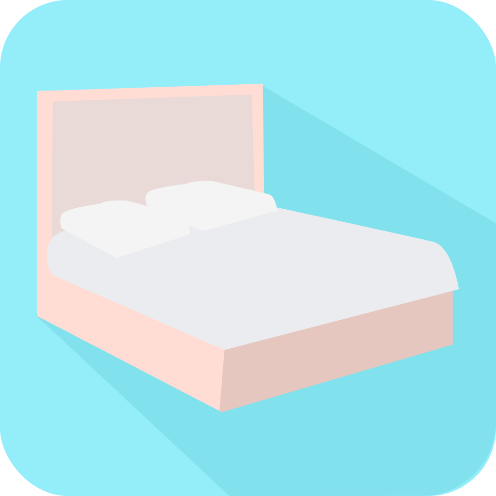

  

    
    
    
    
    

# sleep

Sleep is an Android app to help you fall asleep to nature sounds. It works in background mode so you can easily turn off your phone screen and rest.

<!-- Download Now: [sleep](https://play.google.com/) -->

## Screens

### Initial Screen

  

    
  

 

### Sound Screen

  

    
  

 

### Background Mode

  

    
  

 

## Built With:

- [x] React Native
- [x] Typescript
- [x] Styled-Components
- [x] React Native Track Player
- [ ] Soon to be deployed to Google Play and Amazon Appstore

## Contributions

Feel free to contribute or report issues and improvements.

## Disclaimer

All of the sounds are licensed under Creative Commons Attribution license and retrieved from [Freesound](https://freesound.org/).

## Author Info

- Twitter - [@alissonsleal](https://twitter.com/alissonsleal) <i>dms are open</i>
- Discord - [Alisson#0629](https://discord.com/)
- StackOverflow - [Alisson Leal](https://stackoverflow.com/users/14122260/alisson-leal)

[Go to the top 🚀](#sleep)

  

